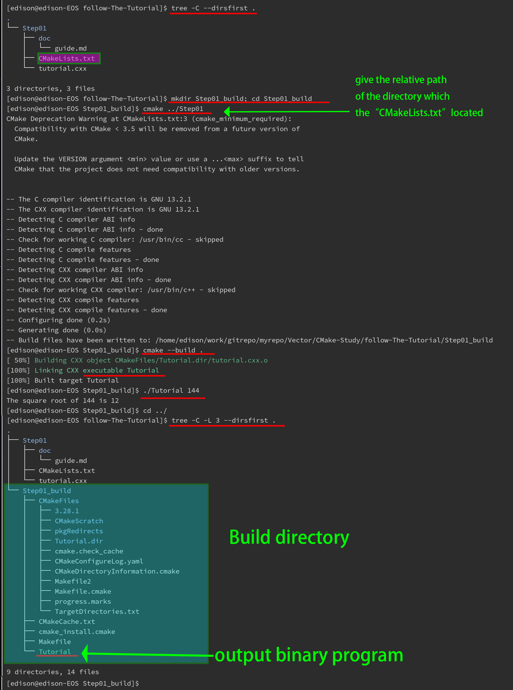
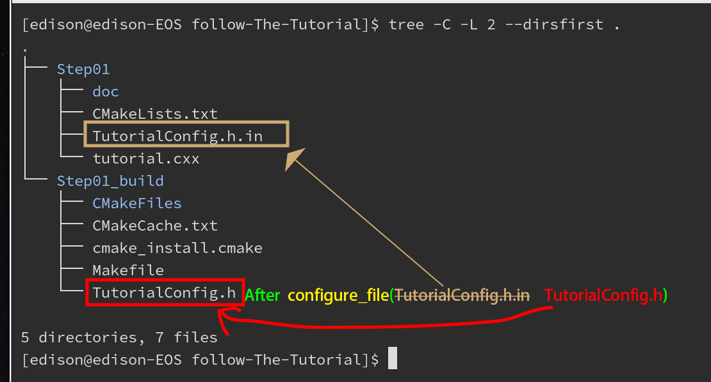

# Command Line 'cmake' 
1. Create a new directory for building the project ( for the purpose of seperate source code and built objects ) 
1. Enter into the new directory from Step-1 
1. call 'cmake' command with the given relative path which contain the root file 'CMakeLists.txt' to generate the build system ( Makefile ) 
1. build the project by calling 'cmake --build .' at the working directory 
1. try to run the program which has been built by Step-4 


Please see the following image to understand the detail :





# Config Program's version by 'cmake' command 

Step-1. Prepare a header file named "TutorialConfig.h.in" 

```cpp
//
// TutorialConfig.h.in
//
// the configured options and settings for Tutorial 
//   ( the value is given in the root  file : "CMakeLists.txt" )
// Notes : the config content of the version must following this format : 
//
//          <ProjectName>_VERSION_MAJOR
//          <ProjectName>_VERSION_MINOR
//
// the final header file "TutorialConfig.h"   
//       will be configed well and generated  by CMake Program
//
//  ********************************************************************
//       and output to the working diretory which runs 'cmake' command
//  ** Rather than ** in the same diretory of the    tutorial.cxx
//  ********************************************************************
//
//  so you must indicate the correct include path of the header file "TutorialConfig.h"
//
//      "${PROJECT_BINARY_DIR}" is the right path pointer to the build output path
//
#define Tutorial_VERSION_MAJOR @Tutorial_VERSION_MAJOR@
#define Tutorial_VERSION_MINOR @Tutorial_VERSION_MINOR@

```


Step-2. add the config command into CMakeLists.txt 

```CMake

project(Tutorial VERSION 1.0)

# Copy "TutorialConfig.h.in" into the build dir 
# replace the file content of given VERSION number
#          and then rename it to "TutorialConfig.h"
configure_file(TutorialConfig.h.in TutorialConfig.h)

# add the source code "tutorial.cxx" to the project named "Tutorial" 's build file list 
add_executable(Tutorial tutorial.cxx)


#
# this command must be after command  add_executable(...)
#
target_include_directories(Tutorial PUBLIC
                           "${PROJECT_BINARY_DIR}"
                           )

```


Please see the following image to get deep knowledge of the config file :





