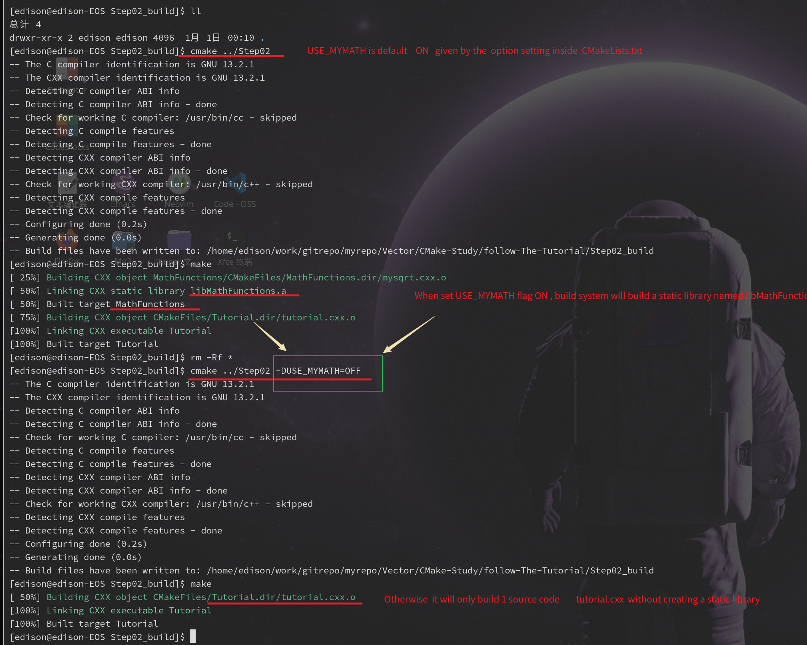

# Step02 : Adding a Library

Run the following commands to switch the flag :  USE_MYMATH
Here -D is a short form of word "Defination"
Here -DUSE_MYMATH should be treat as 2 parts :

1.  -D 
1.  USE_MYMATH=OFF

Neve treat  -DUSE_MYMATH as one argument word


```bash
$ cmake ../Step02 
$ cmake ../Step02 -DUSE_MYMATH=OFF
```

Here, the source code "MathFunctions.cxx" is not necessary during this course , so i delete the file.


Take a short look at the content of header file **==TutorialConfig.h.in==**

```c++
// 
// Notes this sentence : #cmakedefine USE_MYMATH
// 
// if                              SET   "USE_MYMATH"   ON
// it will be replaced as  :       #define USE_MYMATH
// 
// else if                        SET   "USE_MYMATH"   OFF
// it will be replaced as  :     /* #undef USE_MYMATH */
// 

#cmakedefine USE_MYMATH
```


Also see the following illustration for detail :


