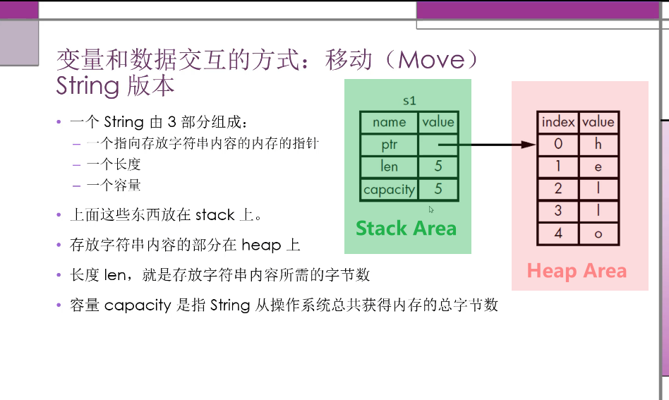
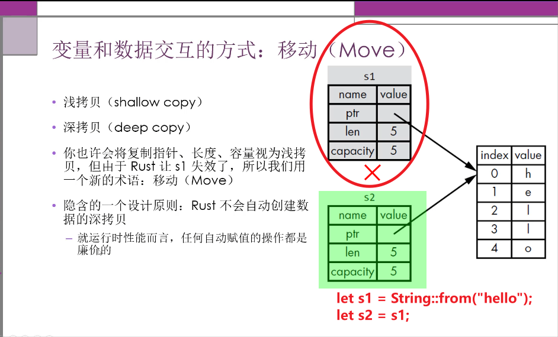
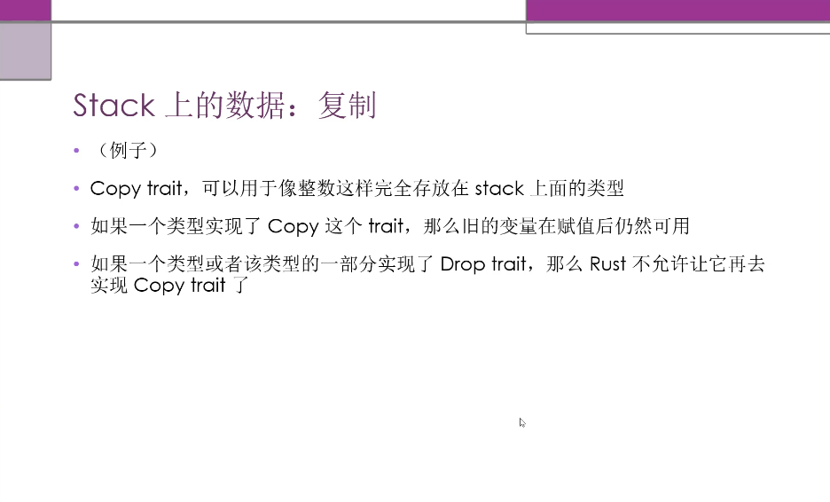
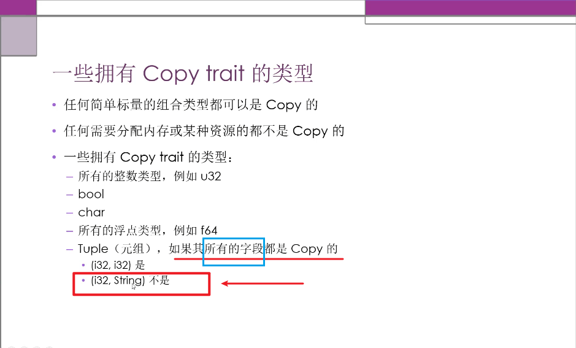
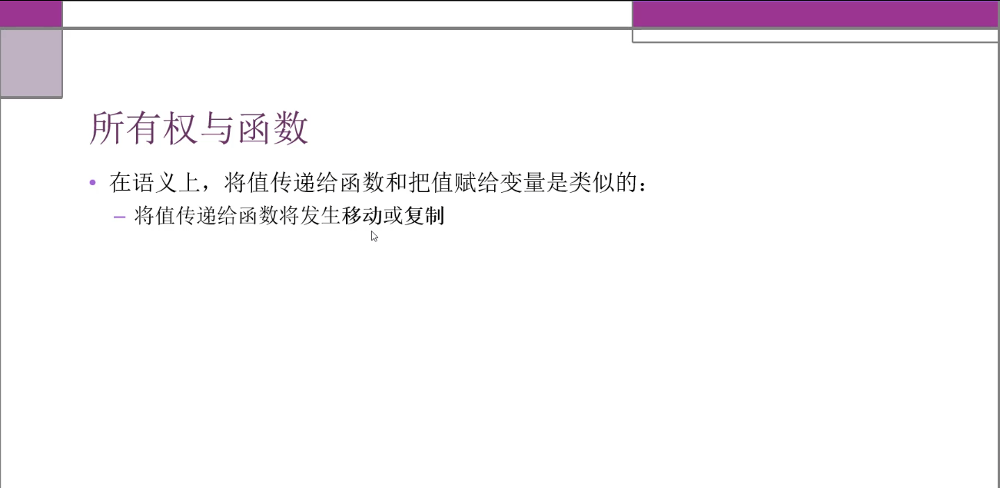
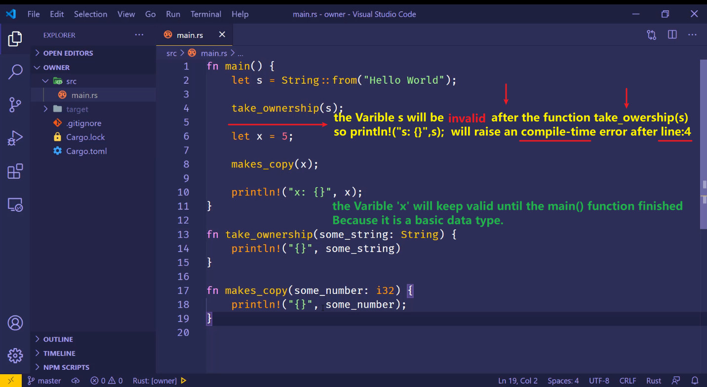
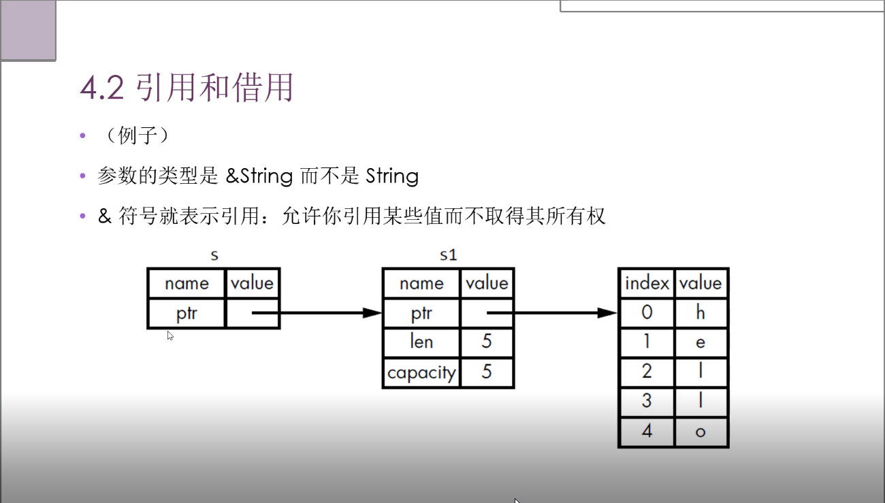
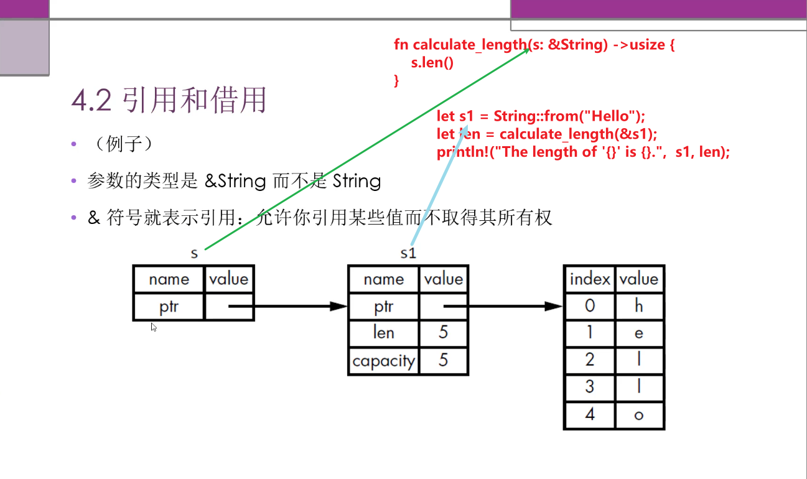

# Rust 4.1.1 - 什么是所有权： Stack vs Heap
## Rust 采用了一种新的方式来管理内存 

## Stack vs Heap 
- 内存是通过一个所有权系统来管理的，其中包含一组编译器在编译时检查的规则。(即 编译器已经帮助你，检查 可能出现内存不安全的 代码片断， 并报错 )
- 当程序运行时， 所有权特性不会[减慢]程序的运行速度

### 所有存储在 **==Stack==** 上的数据必须拥有 ==已知的固定的== 大小
**==编译时大小未知==**的数据或**==运行时大小可能发生变化==**的数据必须放在 **==Heap==** 上

### Heap 内存组织性差一些 :
- 当你把数据放入 heap 时，你会请求一定数量的空间
- 操作系统在 heap 里找到一块足够大的空间，把它标记为[已经在使用的], 并返回一个指针，也就是这个空间的地址 
- 这个过程叫做在 heap 上进行内存分配，有时仅仅称为"分配"

- 把值压到 Stack 上不叫分配
- 因为指针是已知固定大小的，可以把指针存放在 Stack 上。 
	- 但如果想要实际数据，你必须使用指针来定位 
- 把数据压到 Stack 上要比在 heap 上分配快得多 :
	- 因为操作系统不需要寻找用来存储新数据的空间，那个位置永远在 Stack的顶端
- 在 Heap 上分配空间需要做更多的工作 : 
	- 操作系统首先需要找到一个足够大的空间来存放数据， 然后要做好记录(此块内存已经被占用了) , 以方便下次分配 


Stack vs Heap 访同数据
- 访同 Heap中的数据要比访同 Stack 中的数据慢，因力需要通这指针才能找到 Heap 中的数据 
	- 对于现代的处理器来说，由于缓存的缘故，如果指令在内存中跳轮的次效越少，那么速度就越快 

- 如果数据存放的距离比较近，那么处理器的处理速度就会更快一些 ( Stack上 )
	- 如果数据之同的距离比较远，那么效理速度就会慢一些  ( Heap上 )


### Stack vs Heap 所有权存在的原因
- 所有权解决的问题： 
	- 跟踪代码的哪些部分正在使用 Heap 的哪些数据 
	- 最小化 Heap 上的重复数据量 
	- 清理 Heap 上未使用的数据以避免空间不足。 
- 一旦你懂的了所有权，那么就不需要经常去想 Stack 或 Heap了。 
- 但是知道管理 Heap 数据是所有权存在的原因，这有助解释它为什么会这样工作。


### The Stack and the Heap
> Many programming languages don’t require you to think about the stack 
> and the heap very often. But in a systems programming language like 
> Rust, whether a value is on the stack or the heap affects how the 
> language behaves and why you have to make certain decisions. Parts of 
> ownership will be described in relation to the stack and the heap later 
> in this chapter, so here is a brief explanation in preparation.
> 
> Both the stack and the heap are parts of memory available to your code 
> to use at runtime, but they are structured in different ways. The stack 
> stores values in the order it gets them and removes the values in the 
> opposite order. This is referred to as last in, first out. Think of a 
> stack of plates: when you add more plates, you put them on top of the 
> pile, and when you need a plate, you take one off the top. Adding or 
> removing plates from the middle or bottom wouldn’t work as well! Adding 
> data is called pushing onto the stack, and removing data is called 
> popping off the stack. All data stored on the stack must have a known, 
> fixed size. Data with an unknown size at compile time or a size that 
> might change must be stored on the heap instead.
> 
> The heap is less organized: when you put data on the heap, you request a 
> certain amount of space. The memory allocator finds an empty spot in the 
> heap that is big enough, marks it as being in use, and returns a 
> pointer, which is the address of that location. This process is called 
> allocating on the heap and is sometimes abbreviated as just allocating 
> (pushing values onto the stack is not considered allocating). Because 
> the pointer to the heap is a known, fixed size, you can store the 
> pointer on the stack, but when you want the actual data, you must follow 
> the pointer. ==**Think of being seated at a restaurant. When you enter, you**== 
> ==**state the number of people in your group, and the host finds an empty**== 
> ==**table that fits everyone and leads you there. If someone in your group**== 
> ==**comes late, they can ask where you’ve been seated to find you.**==  
> ==** Here the number of people is a changeable amount , the host plays a role of OS **== 
> ==** which knows which memory is avaliable for guest use , and the table number given by the host **==
> ==** is like the pointer address. **==
> 
> Pushing to the stack is faster than allocating on the heap because the 
> allocator never has to search for a place to store new data; that 
> location is always at the top of the stack. Comparatively, allocating 
> space on the heap requires more work because the allocator must first 
> find a big enough space to hold the data and then perform bookkeeping to 
> prepare for the next allocation.
> 
> Accessing data in the heap is slower than accessing data on the stack 
> because you have to follow a pointer to get there. Contemporary 
> processors are faster if they jump around less in memory. ==**Continuing the**== 
> ==**analogy, consider a server at a restaurant taking orders from many **== 
> ==**tables. It’s most efficient to get all the orders at one table before **== 
> ==**moving on to the next table. Taking an order from table A, then an order **== 
> ==**from table B, then one from A again, and then one from B again would be **== 
> ==**a much slower process. if the server has moved between table A and B frequently (Table A is far away from Table B)**== 
> ==** It is in efficient . The time waste on the movement between table-A and table-B for many times. **== 
> By the same token, a processor can do its job 
> better if it works on data that’s close to other data (as it is on the 
> stack) rather than farther away (as it can be on the heap).
> 
> When your code calls a function, the values passed into the function 
> (including, potentially, pointers to data on the heap) and the 
> function’s local variables get pushed onto the stack. When the function 
> is over, those values get popped off the stack.
> 
> Keeping track of what parts of code are using what data on the heap, 
> minimizing the amount of duplicate data on the heap, and cleaning up 
> unused data on the heap so you don’t run out of space are all problems 
> that ownership addresses. Once you understand ownership, you won’t need 
> to think about the stack and the heap very often, but knowing that the 
> main purpose of ownership is to manage heap data can help explain why it 
> works the way it does.


# Rust 4.1.2 所有权规则 
## 3 Rules of the Rust Owership 
- 每个值(可能)都有一个变量，这个变量是该值的所有者 
- 每个值同时只能有一个所有者 。
- 当所有者超出作用域 (scope)时，该值将被删除。 ( call drop(varible)  rather than  varible.drop() )

## 内存和分配 
- 字符串字面值，在编译时就知道它的内容了，其文本内容直接被硬编码到最终的可执行文件里
	- 速度快、高效。是因力其不可变性。
- Strng类型，为了支持可变性，需要在 Heap 上分配内存未保存编译时未知的文本内容: 
	- 操作系统必须在运行时来请求内存 
		- 这一步通进调用String ::from来实现 
	- 当用完String之后，需要使用某种方式将内存返回给操作系统 
		- 这步，在拥有GC的语言中，GC会跟跦并清理不再使用的内存 
		- 没有GC，就需要我们去视别内存何时不再使用，并调用代码将它返回。 
			- 如果忘了，那就浪费内存。 
			- 如果提前做了，变量就会非法 
			- 如果做了两次，也是Bug。必须一次分配对应一次释放 

- Rust 采用了不同的方式 : 
    对于某个值来说，当拥有它的变量走出作用范围时，内存会立即自动的交还给操作系统 

## 变量和数据交互的方式 : 移动(Move)
String版本
```
    let s1 = String::from("hello");
    let s2 = s1;
    /***************************************************
        After the assignment of  the previous statement :   
                let s2 = s1;

        the varible 's1' will be invalid.  // implicit call   drop(s1);
        the varible 's2' take the owership of String("hello") on the heap area


    ****************************************************/


```










返回值与作用域。
- 函数在返回值的过程中同样也会发生所有权的转移
-（例子）
- 一个变量的所有权总是遵循同样的模式：
	- 一把一个值赋给其它变量时就会发生移动
	- 一当一个包含 heap 数据的变量离开作用域时，它的值就会被 drop 函数清理，除非数据的所有权移动到另一个变量上了


```
//                    '&'  means the s is a const reference of varible whose type is String
fn calculate_length(s: &String) -> usize {
    s.len()
}

fn main() {
    let s1 = String::from("Hello");

    //   After the function calculate_length(&s1) finished, 
    //   's1' keep the owership and will not become invalid 
    //                        '&'  is the reference symbol of a varible 
    //                         &s1    return a const reference of s1 
    let len = calculate_length(&s1);

    //                                    's1' keep valid after the function
    println!("The length of '{}' is {}.",  s1, len);
}


```





```
//                    '&mut'  means the s is mutable varible whose type is String
fn calculate_length(s: &mut String) -> usize {
    s.push_str(", World");
    s.len()
}

fn main() {
    let mut s1 = String::from("Hello");

    //   After the function calculate_length(&s1) finished, 
    //   's1' keep the owership and will not become invalid 
    //                        '&'  is the reference symbol 
    //                         &s1    return a mutable reference of s1 
    let len = calculate_length(&mut s1);

    //                                    's1' keep valid after the function
    println!("The length of '{}' is {}.",  s1, len);
}


```

## 可变引用
-（例子）
```
fn main()
{
    let mut s = String::from("Hello");
    let s1 = &mut s;

    // Compile Error : because there are more than 1 mutable reference of the same mutable varible
    // the first  one is s1 
    // the second one is s2 
    let s2 = &mut s;  
}
```

- 可变引用有一个重要的限制: 在特定作用域内，对某一块数据，只能有一个可变的引用。
	- 一这样做的好处是可在编译时防止数据竞争。 
  
- 以下三种行为下会发生数据竞争: 
	- 两个或多个指针同时访问同一个数据 
	- 至少有一个指针用于**==写入==**数据 
	- 没有使用任何机制来同步对数据的访问 

- 可以通过创建新的作用域，来允许非同时的创建多个可变引用 (例子)

```
fn main()
{
    let mut s = String::from("Hello");
    {
        let s1 = &mut s;
    }

    // Compile OK : because s1 is out of date after the scope ( after the right paretheses , s1 will be droped ( call drop(s1) ) )
    let s2 = &mut s;  
}
```

## 另外一个限制
- **不可以** ==同时拥有== 一个可变引用和一个不变的引用
```
fn main()
{
    let mut s = String::from("Hello");
    let s1 = &mut s;  // 1 mutable reference has been created 
    // Compile Error : because there existed 1 mutable reference and 1 immutable reference at the same scope
    let s2 = &s;      // 1 immutable reference has been created 
}
```

- 多个不变的引用 **是可以** 的
```
fn main()
{
    let mut s = String::from("Hello");
    let s1 = &s;  //      1 immutable reference has been created 
    // Compile OK : because there existed 1 mutable reference and 1 immutable reference at the same scope
    let s2 = &s;  // another  immutable reference has been created 
}
```


## 悬空引用 Dangling References
- 悬空指针 (Dangling Pointer) : 一个指针引用了内存中的某个地址，而这块内存可能己经释放并分配给其它人使用了。
- 在 Rust 里，编译器可保证引用永远都不是悬空引用：
	- 如果你引用了某些数据，编译器将保证在引用离开作用域之前数据不会离开作用域

- (例子)
```
fn main()
{
    let r = dangle();
}

fn dangle() -> &String {
    let s1 = String::from("Hello");
    // !!! Compile Error !!! 
    //    Because after the dangle() function executed the local varible 's' will be droped
    // the return value of the 's1's reference will become invalid 
    &s  
}
```


## 引用的规则
- 在任何给定的时刻，只能满足下列条件之一 : 
	- 一个可变的引用
    - 任意数量不可变的引用

- 引用必须一直有效

