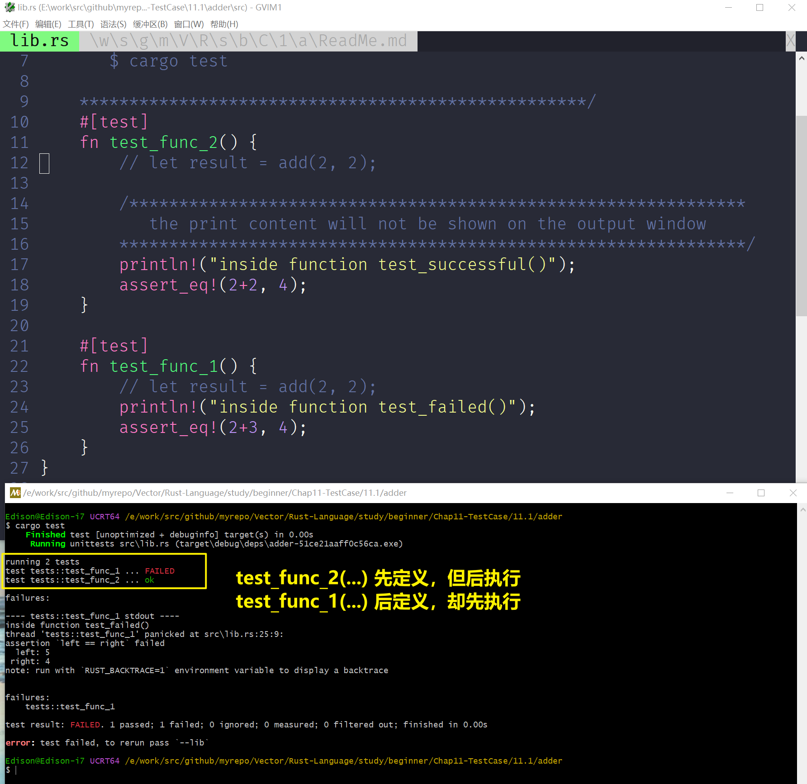

# 关于 test 函数
**== 被 #[test] 修饰的函数就是 测试函数==**

```Rust
#[cfg(test)]
mod tests {
    /**************************************************
       Attribute marked with #[test] is a test function 

       Use the following command line : 
       $ cargo test 

    ***************************************************/
    #[test]
    fn test_func_2() {
        ...
    }

    #[test]
    fn test_func_1() {
        ...
    }
}

```

# 使用以以命令执行 所有被标注为 #[test]  的测试函数
```Shell
$ cargo test
```


Also see the following ScreenShot



# Attention Please 
注意 : 
1. 如果多个测试函数中，只要有1个测试函数Failed, 那么整个测试即宣告Failed, 但是中途某个Failed的函数并不会中断所有其他后续测试的执行, 即 1 2 3 4 5 ，共5个测试函数按先后顺序执行，当 函数#3 测试失败后， 整个测试不会中断，不影响 4 5 的执行 
1. 同一个文件，**==[并不是]==**先定义的函数，测试执行时，它就先执行的
在这次的测试过程中 
    1. test_func_1() 先执行 ( 虽然 test_func_1() 的实现在文件的行数中，落后于 test_func_2() )
    1. test_func_2() 后执行

1. println!(...) 在测试过程中，不会显示在 控制台的 输出内容中 
1. 测试 3步骤 ( 3 (A)s )
    1. Arrange Data (准备数据阶段)
    1. Action       (执行)
    1. Assert       ((触发)断言)


