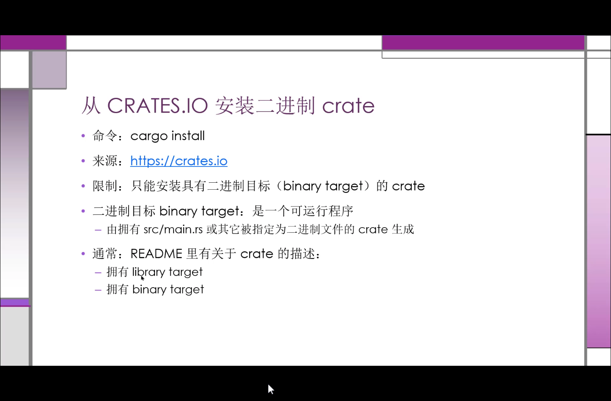

# 14.1
## command line : Cargo build
```Shell
$ cargo build              # Default for                <dev>     profile 
$ cargo build --release    # Explicitly specified for   <release> profile 
```


## Self-Defined build configuration 
1. modify the config file named 'Cargo.toml' 

```toml 
// Add the following lines to config dev profile
[profile.dev]
opt-level = 1           // 0 ( unoptimized ) is the default value for dev whose range is [0,3] 

[profile.release]
opt-level = 3           // 3 is the default value for release [0,3]

```

# 14.2 
## Document comment

```Rust
/* ********************************************************

"Document comment" begins with    3 successive /   

**********************************************************/


/// A line is starts with 3 / is a kind of  "Document comment" 
/// You can use write down some comment by MarkDown syntax
///
/// # Examples
///
/// ```Rust
///    let num1   = 5;
///    let answer = my_crate::add_one(num1);
///    
///    assert_eq!(6, answer);
///
///    let num2    = 6;
///    let answer2 = my_crate::add_one(num2);
///    
///    assert_eq!(6, answer2);
/// ```

pub fn add_one(x: i32) -> i32 {
    x + 1
}

```

You can use the following command line to build a document with html format
```Shell
$ cargo doc           // generate the html document only (it will be located at    target/doc/<my_crate>/index.html )
$ cargo doc --open    // generate the html document and then open it by the default web browser 

# 
///    assert_eq!(6, answer2);  will be failed by the test 
$ cargto test         // it will make a test from the /// document comment


```


## Crate Comment

```Rust
//!  This line is a  'Crate Comment'
//!       line 1 ...
//!       line 2 ...
//!       line 3 ...
//!          ...
//!          ...
//!       line n ...

```

## 14.4    Publish your crates    to the website  crates.io
```Bash
#
#
# API-token can be generated from the following url :   
#     [crates.io Official Website](https://crates.io/)    // you must login in the website by your github account )
#
####################################################################################################
#
# It will store your token in the local disk path : ~/.cargo/credentials 
#
####################################################################################################
$ cargo login <API-token>
        <font size="10" color="green">Login</font> token for `crates.io` saved 


####################################################################################################
    # Config your project's meta fields 
    [package]
    name = "xxxx"  # It must be unique inside the website "crates.io" ( Input the keywords from search bar to query whether it existed or not )
    description = "....."
    license = "Apache 2.0 OR MIT OR GNU OR GPLv3 OR GNU AGPLv3"   # visit to [Licenses](https://spdx.org/licenses/) for detail 
    version = "xx.xx.xx"
    author = "xxx"
    edition = "xxx"
####################################################################################################

# --allow-dirty  means no matter whether your git repo is clean or modified ,  publish your crates forcely
$ cargo publish      [--allow-dirty]

##########################################################################
#
# crate 一旦发布，==**就是永久性的 : 该版本无法覆盖，代码无法删除**==
#   - 目的: 依赖于该版本的项目可继续正常工作 
#
##########################################################################

#
#   Also see the syntax     [Semantic](http://semver.org)
# update your crate to a new version 
version = "xx.xx.xx+1"


# cargo yank to   backward to your previous version without delete the given version
$ cargo yank --vers 1.0.1


- 1.0.1        // Before yank  1.0.1 is the latest version 
- 1.0.0    <-- // After execute    cargo yank --vers 1.0.1    ver 1.0.1 become the latest version

#
# <Cancel> the backward action been excuted before 
#
$ cargo yank --vers 1.0.1  --undo


```

# 14.6     install a given crate from   url   [CRATES.IO](https://crates.io)  and cargo subcommand
 
```bash
##################################################
#
#     installed at the pwd path     ./bin/...
# or  $HOME/.cargo/bin    |      C:\User\<your_name>\.cargo\bin
#
##################################################
$ cargo install <a given binary target crate name>


# How to get the environment varible's value inside Windows System ?
$ echo %HOME%


# How to get the environment varible's value inside Linux/Mac System ?
$ echo ${HOME}  
$ echo $HOME


# cargo sub command introduction :

$ cargo-<some_sub_command>

$ cargo  some_sub_command


# e.g.
# binary program "cargo_checkout"  has been existed in  C:\User\<your_name>\.cargo\bin\

$ cargo   checkout // run the cargo_checkout program 


```


