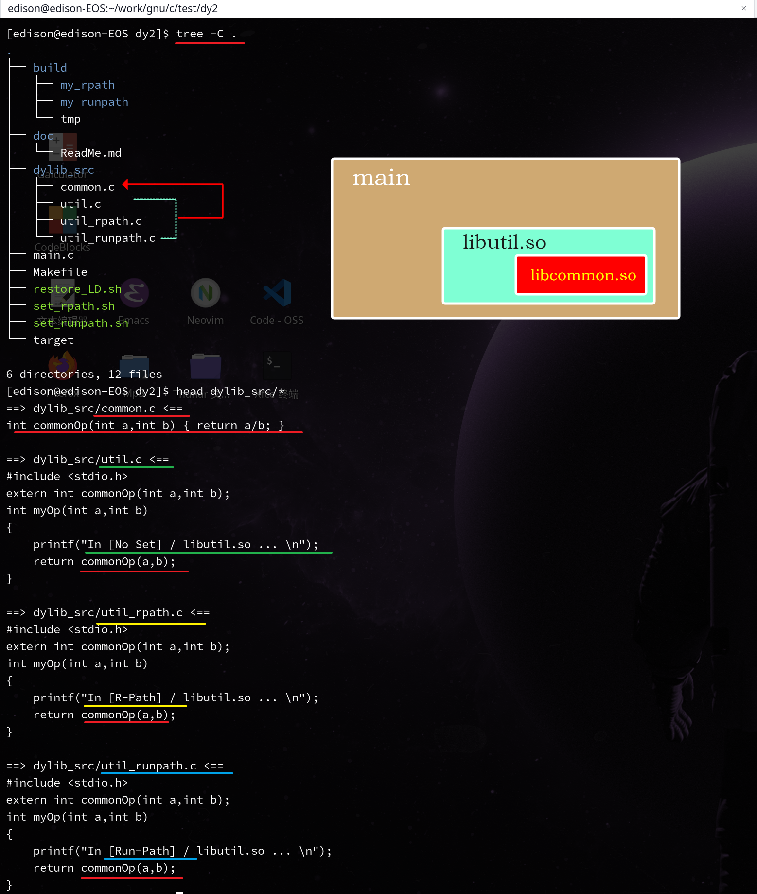
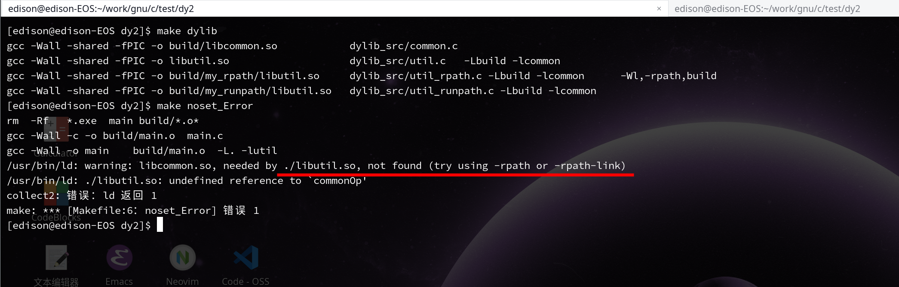

# -rpath-link

main       -->   libutil.so
libutil.so -->   libcommon.so

因此，编译时， libutil.so 与 libcommon.so 这2个动态链接库 都是必须要参与 链接的库文件
否则，如果单单链接 libutil.so , 会 链接失败

此时需要 使用 -rpath-link 来 设置 main 程序的 **==间接依赖==** 的搜索路径
注意， **==-rpath-link==** 只是在 **==编译链接时期==** 起作为
如果需要使 可执行程序 在运行时，也能顺便找到 直接/间接 依赖
需要将所有的依赖链上的每一个环节的搜索路径都 设置进 **==-rpath==**

