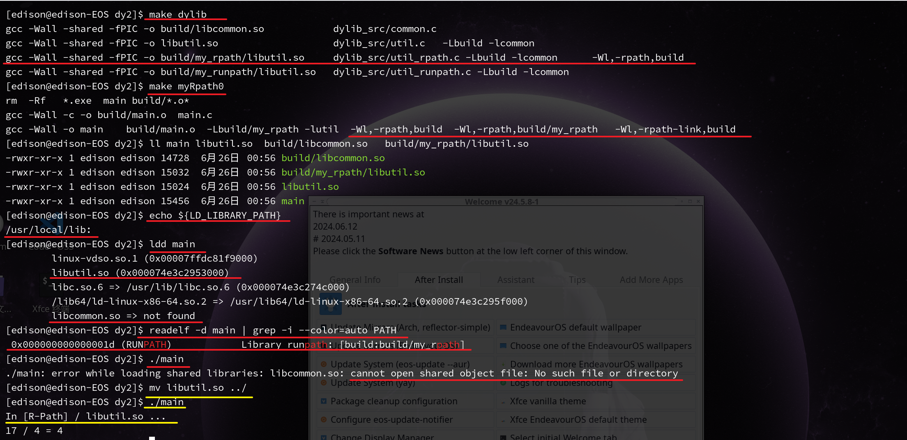
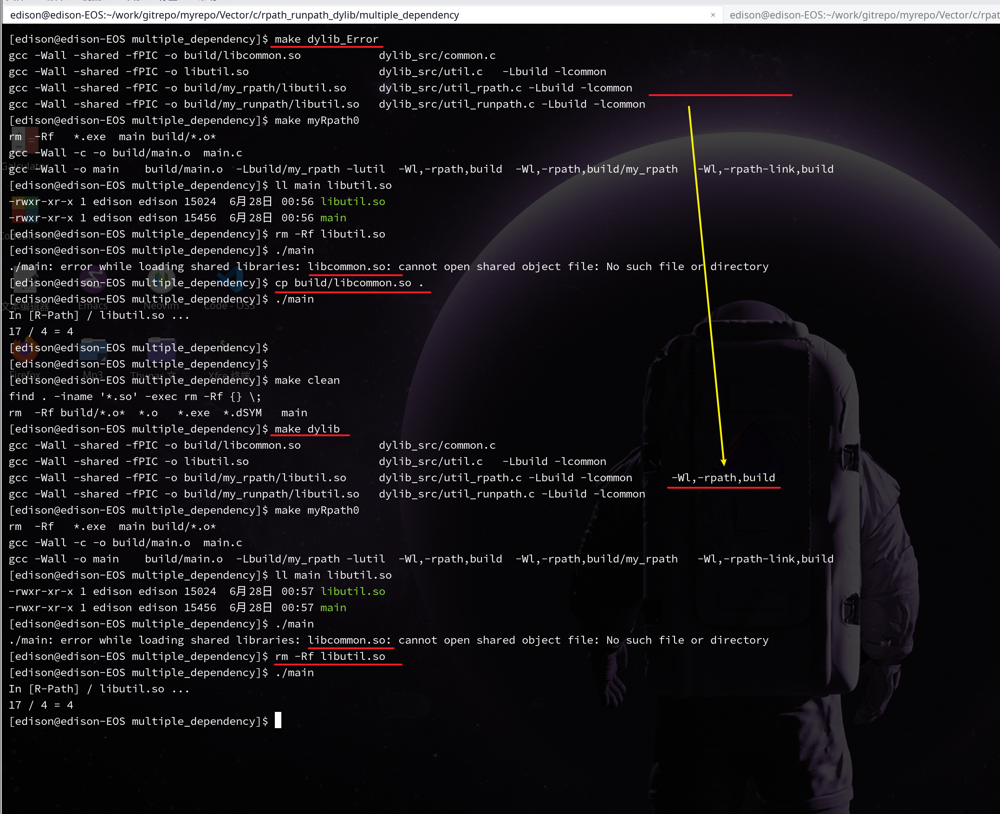
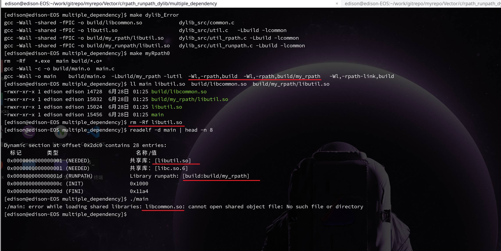

# -rpath-link
请先阅读 以下 ReadMe 文档，里面讲解了 可执行程序 单一依赖 一个 动态库的 情况
**../single_dependency/doc/ReadMe.md**

# 下面讲解 **==链式==**  依赖的情况

main       -->   libutil.so
libutil.so -->   libcommon.so

因此，编译时， libutil.so 与 libcommon.so 这2个动态链接库 都是必须要参与到 链接过程 中
否则，如果单单链接 libutil.so , 会 链接失败

此时需要 使用 -rpath-link 来 设置 main 程序的 **==间接依赖==** 的搜索路径
注意， **==-rpath-link==** 只是在 **==编译链接时期==** 起作为
如果需要使 可执行程序 在运行时，也能顺便找到 直接/间接 依赖
需要将**直接依赖**列表中每一个动态库 设置进 **==-rpath==** ， 但 **间接依赖** 留在 动态链接库的 生成中指定
即

   main       设置  libutil.so    的 rpath 搜索路径   **==( main 无须设置间接依赖 libcommon.so 的搜索路径 )==**
   libutil.so 设置  libcommon.so  的 rpath 搜索路径

如果在生成 libutil.so 时，不指定 rpath 搜索路径
那么，main 运行时，将由于 找不到 libcommon.so 而报错，此时，只要将 libcommon.so 复制到 main的同一级目录后，即可运行成功

如果在生成 libutil.so 时，指定 rpath 搜索路径
那么，即使删除 libutil.so 也能正常执行  

即使在 可执行程序中的 rpath 中设置了 直接依赖 与 间接依赖的 搜索路径
也可能 运行时失败

因为 直接依赖 与 间接依赖 之间的 rpath ，如果此搜索路径没有设置的情况下

dependency chain 也会被剪断，从而导致 
main 能找到 libutil.so ， 但 libutil.so 找不到 libcommon.so ，以导致运行时错误

