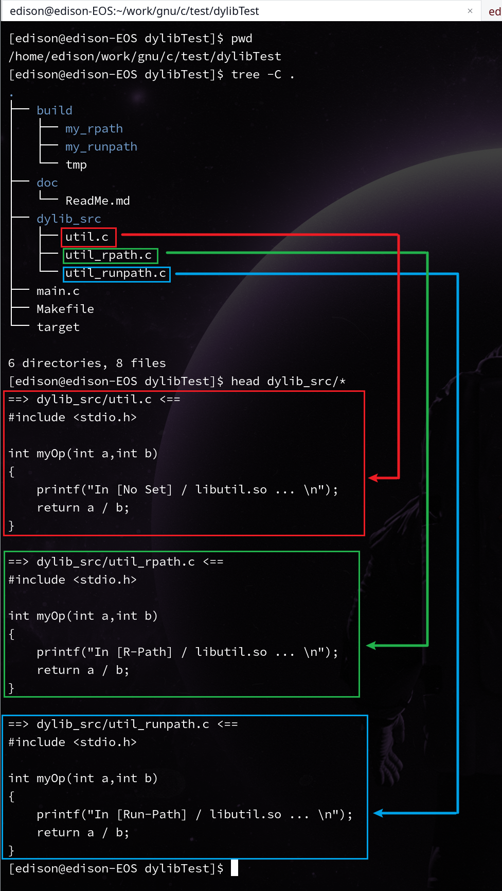
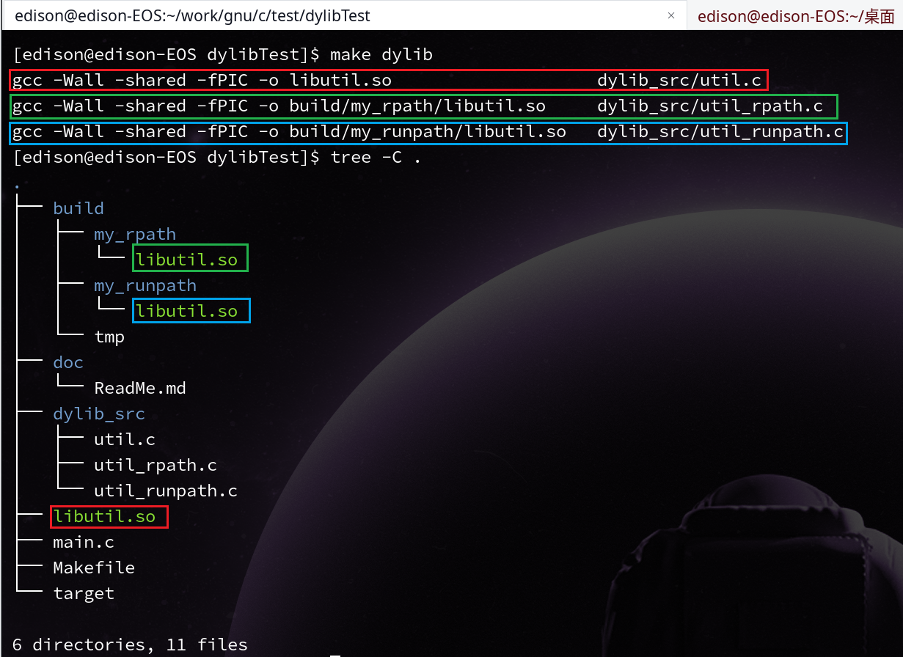
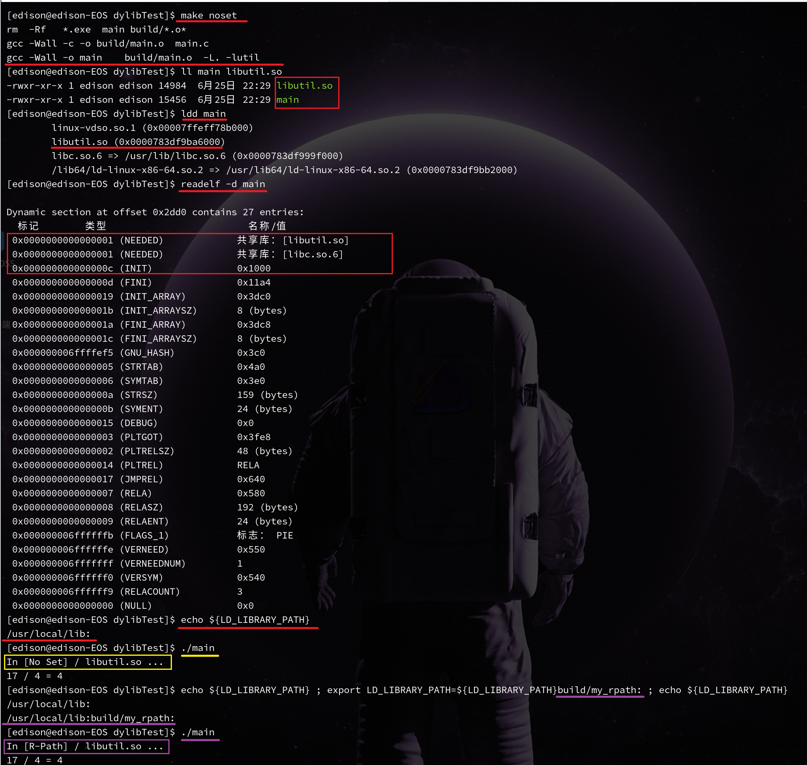
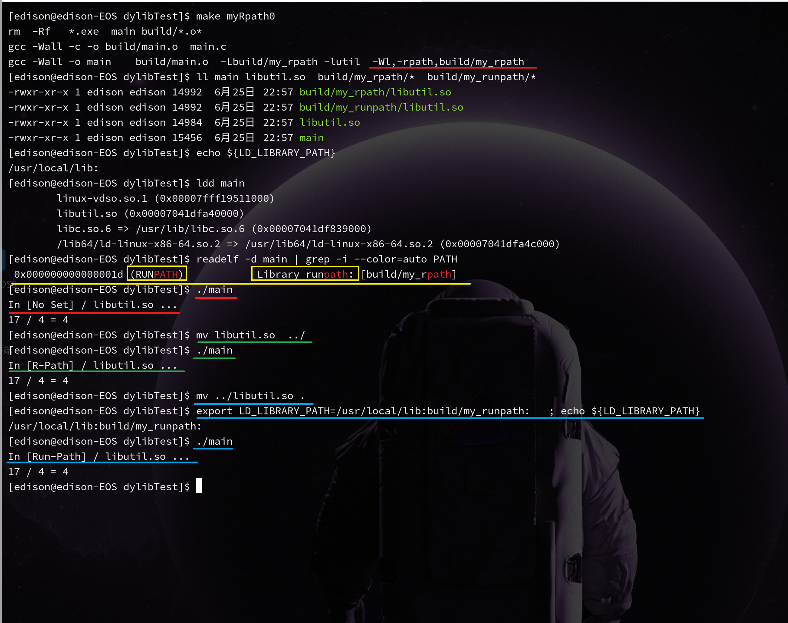
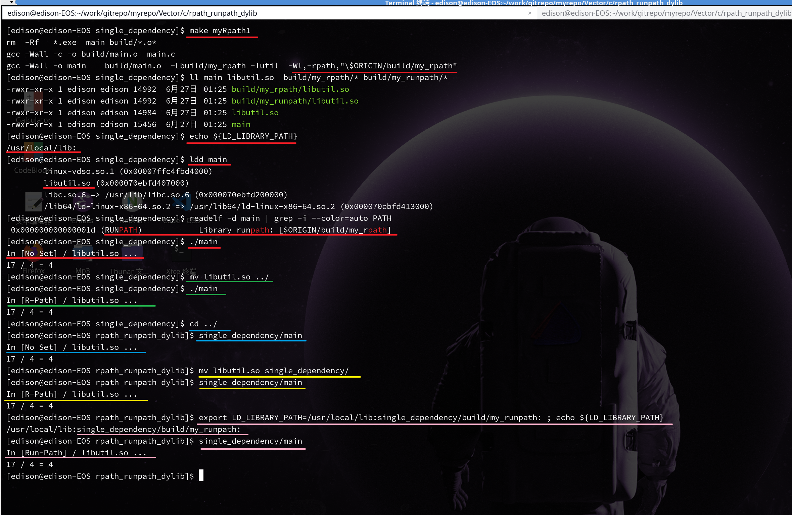
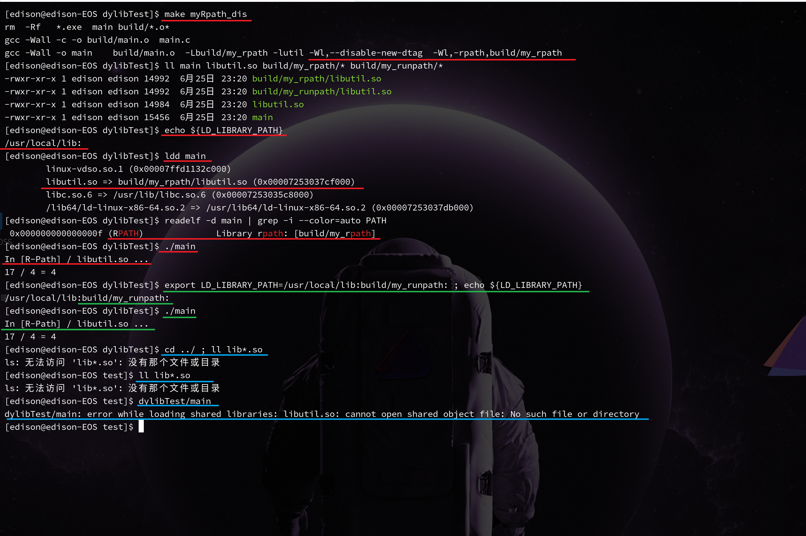
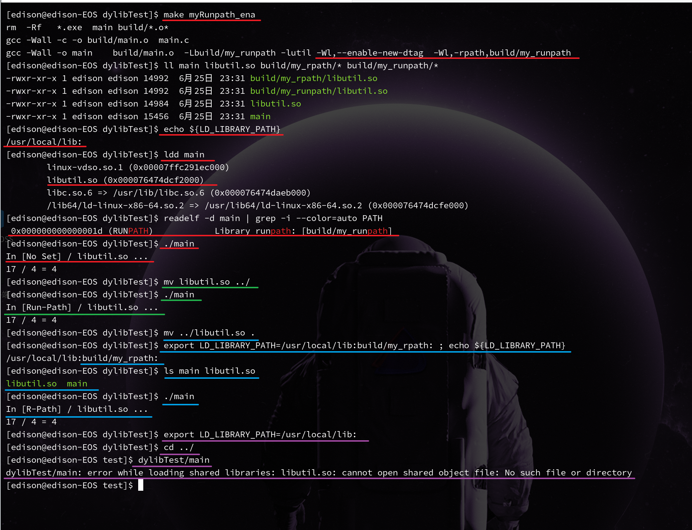

# rpath vs runpath
可执行程序 与 它运行时所需要的动态链接库 的关系 

首先:可执行程序内部 **==必须==** 包含 它运行时所需要的动态链接库的 文件名
其次:可执行程序内部 **==可以不包含==** 动态链接库所在的路径位置

# Environment


## example



在dylib_src 中，有 3个 生成动态链接库的 C语言源文件
- util.c          // 打印 No Set ,   并返回 a/b 的商数
- util_rpath.c    // 打印 R-Path ,   并返回 a/b 的商数
- util_runpath.c  // 打印 Run-Path , 并返回 a/b 的商数

然后分别将以上这3个文件，编译生成到以下的3个目录下
- util.c          =>  与 可执行文件在同一目录下   libutil.so
- util_rpath.c    =>  build/my_rpath/libutil.so
- util_runpath.c  =>  build/my_runpath/libutil.so


### noset


  不进行任何设置 ，仅仅让编译、链接能通过，生成可执行程序  main
但是 链接选项，是必须的，即必须指定 动态链接库的路径，以及它的名字 -lutil ( 表示需要链接 libutil.so or libutil.a )
因为如果不指定， main.c 中调用 myOp(...) 将无法得知此函数的实现细节 ，将在 链接过程中，报出链接失败的错误

```bash
$ gcc -Wall -o main  build/main.o   -L.  -lutil
```

  编译完成后，生成的 可执行程序 中，已经包含了 它本身执行时需要的 动态链接库的 名称了
即 动态链接库名 已经被写入了 可执行文件 的内容中(二进制内容)
  因此，在程序运行时，如果 当前工作目录下，没有 libutil.so , 那么会 报错 运行时失败

但当 **==LD_LIBRARY_PATH==** 被重新设置后，可以改变 动态链接库的 搜索优先级
从 **LD_LIBRARY_PATH** 中，先找 动态链接库 


### myRpath0


如果设置了 -rpath , 但在 gcc13.2.1 时 -rpath 设置的不是 rpath 而是 runpath
-rpath = xxx
-Wl,-rpath,build/my_rpath

则通过 readelf 命令查看依赖库时 ，可以看到  **==RUNPATH==** 的具体搜索路径
但 当时的 工作路径的搜索优先级**==依然高于==**RUNPATH
但当 **==LD_LIBRARY_PATH==** 被重新设置后 , 它的优先级更高 
    LD_LIBRARY_PATH > CWD > RUNPATH


### myRpath1


如果设置了  $ORIGIN/path/to/dynamiclib   // "\$$ORIGIN/build/my_rpath"
那么搜索路径，将不再仅仅 局限在 与 可执行程序同一目录层次的 相对路径进行搜索
而是以  可执行程序 作为相对路径的起点，再进行搜索
即可以在 非可执行程序所在的当前目录， 运行 此可执行程序


### myRpath_dis ( rpath )


-Wl,--disable-new-dtag   //  =>  really set 'rpath'
    rpath > LD_LIBRARY_PATH > CWD > RUNPATH


### myRpath_ena ( runpath )

-Wl,--enable-new-dtag   //  =>  set runpath   rather than   rpath


## Conclusion
Search Order : 
1. rpath
1. LD_LIBRARY_PATH
1. .                 ( current working directory )
1. runpath


