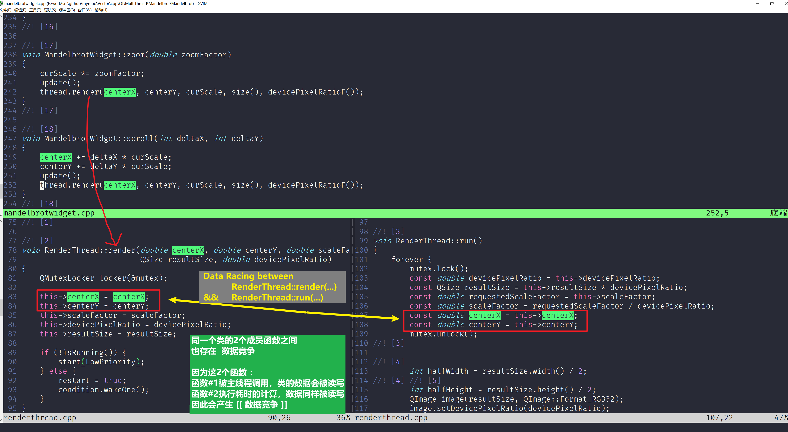
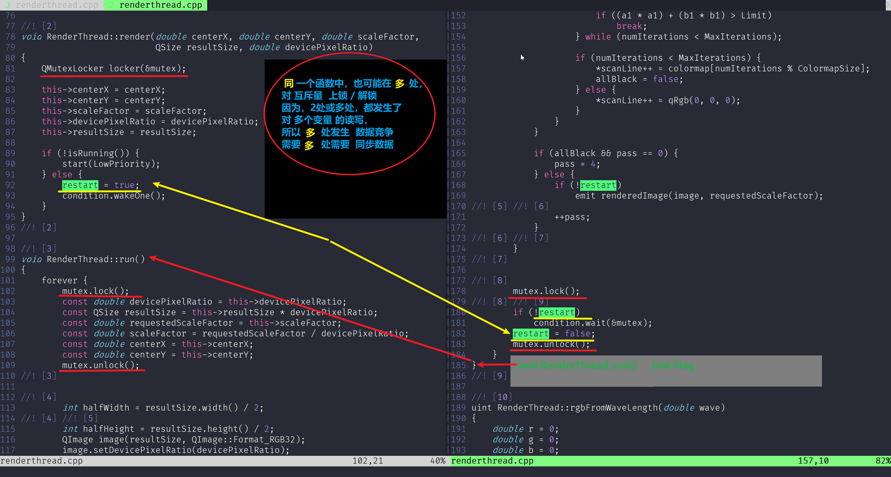

# Troublesome 
通常而言，只有当2个或者多个线程并发执行时，才会 产生数据竞争的 问题和困扰
具体而言，线程的执行单元一般是一个函数，一个 Lambda 表达式 

很多人会有这样子一个==**误区**==，那就是线程的执行函数==**至少有2个或2个以上时，才会产生数据竞争的情况**==
==**但是其实不然**==

e.g.
    有一个任务: 需要统计2个班级内英语成绩在80分及以上的人数总和

```c++
static int score_80_count = 0;

struct classScore {
    int scores[50]; 
    int nStudents;
};

void* statistics_80(void* pInfo)
{
    classScore* pScores = (classScore*)pInfo;
    if ( pScores == NULL ) {
        printf("[ERROR] pointer is NULL inside fn statistics_80(...) ! \n");
        return NULL;
    }

    for( auto i = 0; i < pScores->nStudents; ++i ) {
        if ( pScores->scores[i] >= 80 ) {
            /************************************************** 
              Here is a data racing to be synchronized
            **************************************************/
            ++score_80_count;
        }
    }

    return NULL;
}


int main(int argc, char* argv[])
{
    pthread_t tid1;
    pthread_t tid2;

    classScore class1;
    class1.scores[0] = 76; class1.scores[1] = 81; class1.scores[2] = 90;  class1.scores[3] = 64; // ...
    class1.nStudents = 35;

    classScore class2;
    class2.scores[0] = 57; class2.scores[1] = 95; class2.scores[2] = 84;  class2.scores[3] = 75; // ...
    class2.nStudents = 41;
    
    // 创建2个执行线程，但他们的执行函数体是 同一个函数，只不过参数是 2个不同班级的 成绩样本 
    pthread_create( &tid1, NULL, statistics_80, &class1 );
    pthread_create( &tid1, NULL, statistics_80, &class2 );

    // 等待 这2个新创建的线程执行完后 , main 函数 主线程再结束运行 
    pthread_join( tid1, NULL);
    pthread_join( tid2, NULL);

    printf("There are %d students' whose score is no less than 80 points. " , score_80_count);
    
    return 0;
}


```

// 以下这一句执行语句， 对于CPU而言，它并不是一个原子不可再细分的操作 
// 而是由 
   
1. 读取变量数值 到 寄存器
1. 寄存器 步进 1个数
1. 从 寄存器 写回 Step #1 的变量中 , 完成更新

++score_80_count;

| Step No.  |   Thread ID   | Action |                     Detail           |         Result        | Comment                               |
|:---------:|--------------:| :----: | :----------------------------------: | :-------------------: | :------------------------------------ |
|1.         | Thread #1     | Load   | RAX  <--  cnt                        |  RAX = 0              |                                       |
|2.         | Thread #1     | INC    | RAX  = RAX +1                        |  RAX = 1              |                                       |
|3.         | Thread #2     | Load   | R==**B**==X  <--  cnt                |  RBX = 1              | Caution                               |
|4.         | Thread #1     | Update | R==**A**==X  -->  cnt                |  cnt = 1              |                                       |
|5.         | Thread #2     | INC    | R==**B**==X  = RBX +1                |  RBX = 1              |                                       |
|6.         | Thread #2     | Update | R==**B**==X  -->  cnt                |  cnt = 1              | cnt 从 Step#4 被RAX更新后的1 ，又被 ==**RBX**== 再次刷新写入，但值没有被预期的改为+2，而还是+1  | 


注意，请仔细观察 Thread#1 与 Thread#2 ，交错执行的 Step #3 ~ #6 

==**这里的关键，就是同一个变量，被读入了2个不同的寄存器中，而 RAX RBX 这2个寄存器并无法做到1方通过另1方**==
==**同一块内存的变量有更新的数据，需要重新读取, 其实他俩是在对 同一块内存变量，进行读写操作**== 


# Qt - Mandelbrot Project ( 曼德尔布罗特 分形 ) 
RenderThread 实现了整个 Mandelbrot 的算法过程， 而这个算法又是比较耗时的 
MandelbrotWidget 窗口控件                                            ( #1 main   Thread ) 
==**调用了**== RenderThread 中的公共接口 RenderThread::render( ... ) ( #2 render Thread )

那么有人可能会问， 渲染线程 中的数据都是封装在 RenderThread 类中的 private 访问权限下的成员变量
只有 RenderThread 内部才能读/写 访问到，为什么还会有数据竞争，需要进行代码层面的同步过程呢？

答案是 : 
==**同一个类的2个函数中，有读/写 相同的成员变量，因此需要进行数据同步**== 
==**( 无论是 RenderThread 类内部的逻辑调用，还是被其他类的逻辑代码块调用，都有数据竞争的时刻存在，因此需要做数据同步 )**==


void RenderThread::run() { ... }

// 被 render(...) 方法  MandelbrotWidget 类调用
void RenderThread::render() { ... }


void RenderThread::run() {
    while(1) {
        // do consumption calculation 
        // use member data

          const double dPR = this->devicePixelRatio;
          const QSize rSZ = this->resultSize * devicePixelRatio;
          const double rSF = this->scaleFactor;
          const double sf = requestedScaleFactor / devicePixelRatio;
          const double cX = this->centerX;
          const double cY = this->centerY;

           ... 

            restart = true;
            condition.wakeOne();
        // 
    }
}

void RenderThread::render(double centerX, double centerY, double scaleFactor,
                          QSize resultSize, double devicePixelRatio)
{
    QMutexLocker locker(&mutex);

    this->centerX = centerX;
    this->centerY = centerY;
    this->scaleFactor = scaleFactor;
    this->devicePixelRatio = devicePixelRatio;
    this->resultSize = resultSize;

    if (!isRunning()) {
        start(LowPriority);
    } else {
        restart = true;
        condition.wakeOne();
    }
}


void MandelbrotWidget::resizeEvent(QResizeEvent* event)
{
    // thread is an instance of class <RenderThread>
    thread.render(centerX, centerY, curScale, size(), devicePixelRatioF());
}

```


```C++
void RenderThread::render(double centerX, double centerY, double scaleFactor,
                          QSize resultSize, double devicePixelRatio)
{
    QMutexLocker locker(&mutex);

    this->centerX = centerX;
    this->centerY = centerY;
    this->scaleFactor = scaleFactor;
    this->devicePixelRatio = devicePixelRatio;
    this->resultSize = resultSize;

    if (!isRunning()) {
        start(LowPriority);
    } else {
        restart = true;
        condition.wakeOne();
    }
}


void RenderThread::run()
{
    forever {
        // Sync #1
        mutex.lock();

          const double devicePixelRatio = this->devicePixelRatio;
          const QSize resultSize = this->resultSize * devicePixelRatio;
          const double requestedScaleFactor = this->scaleFactor;
          const double scaleFactor = requestedScaleFactor / devicePixelRatio;
          const double centerX = this->centerX;
          const double centerY = this->centerY;

        mutex.unlock();


        // Sync #2
        mutex.lock();
          if (!restart) {
              condition.wait(&mutex);
          }
          restart = false;

        mutex.unlock();
    }
}

```


# Also see the following illustration as detail 






