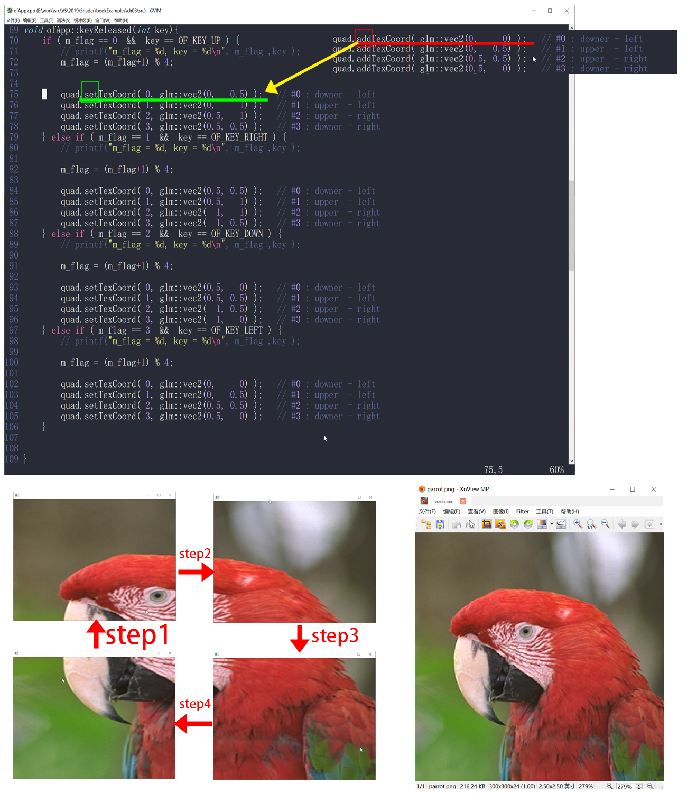

# How to use this program 

Do the steps in order as follows :

1. Press Arrow Up     Key : 🡅 
1. Press Arrow Right  Key : 🡆 
1. Press Arrow Down   Key : 🡇 
1. Press Arrow Left   Key : 🡄 

You will see a quarter of the parrot image one after another by the order

1. Left-Bottom 
1. Left-Top 
1. Right-Top 
1. Right-Bottom 

 

