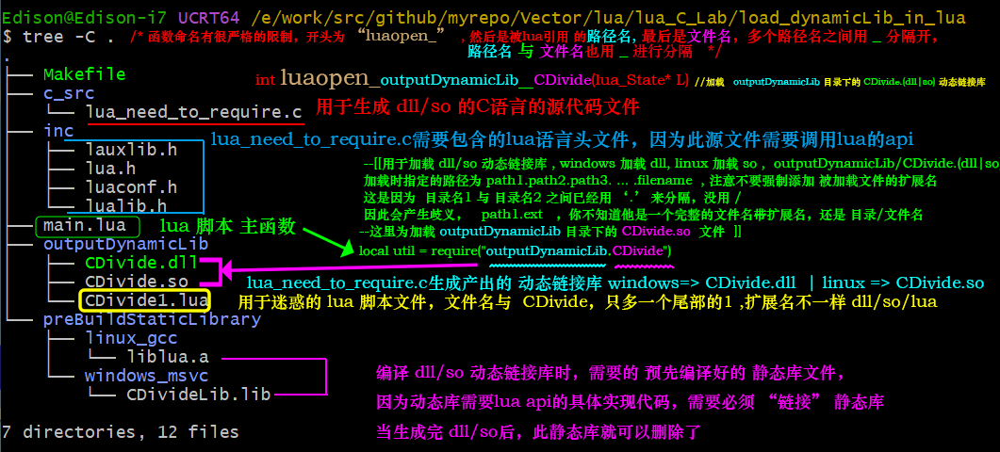

# 如何在 lua 脚本中加载一个 C 语言的动态链接库 ? 

1. 首先编写一个供 lua 调用的 C语言的动态链接库 
   这个库中的代码，有许多苛刻的命名的限制要求

	//
	//  
	//       目标: 最终生成  CDivide.so  or  CDivide.dll
	//
	//       **==__declspec(dllexport)==**  // Windows 生成的dll 需要添加这个 修饰符，让 编译器 知道，这个是被导出的函数，是一个可以供 可执行程序 调用的 dll里导出的 函数
	// 
	// 
	//  Windows代码中必须有一个这样子的函数 导出函数
	//  <font color="red"> luaopen\_ 作为函数的开头</font>  
	//  <font color="green">a<font color="#FF00FF">\_</font>b<font color="#FF00FF">\_</font>c 表示       a/b/c  ，其中 a b c 这3个都是目录名</font>
	//  **<font color="blue">dylibName</font>** 表示   被 lua 加载的动态链接库的名字是  **<font color="blue">dylibName.so</font>** ( Unix/Linux )  或者 **<font color="blue">dylibName.dll</font>** ( Windows )
	//  目录名 与 目录名之前用 <font color="#FF00FF">'\_'</font> 进行分隔开，   最后的目录名 与 动态链接库名之前也用 <font color="#FF00FF">'\_'</font> 进行分隔
	//  最终生成的 动态链接库 名，必须是  **==<font color="blue">dylibName.so  /  dylibName.dll</font>==** ，不能是其他命名
	// 
	// 
	int <font color="red">luaopen\_</font><font color="green">a</font><font color="#FF00FF">\_</font><font color="green">b</font><font color="#FF00FF">\_</font><font color="green">c</font><font color="#FF00FF">\_</font><font color="blue">dylibName</font>(lua_State* L) 
	{ 
	    ...
	} 
	
1. 编译写好的 C 语言的源代码，生成 so / dll ，注意，编译时需要包含一些 lua 的头文件 
	- lauxlib.h
	- lua.h
	- luaconf.h
	- lualib.h
	
	另外，还需要 事先编译好的静态库 liblua.a    or    liblua.lib , 这是因为 动态链接库 会调用 lua的api函数，需要知道他的具体实现，才能 链接 成功
	一旦，成功生成了 xxxx.so / xxxx.dll 后，这个静态库就可以删除了
	
1. lua 脚本调用
	```lua
	--[[
	     注意：
	          加载的搜索顺序是
	
	     先 找  CDivide.lua 文件
	     后 找  CDivide.so / CDivide.dll 文件
	
	     换句话说，如果同一目录下，有2个文件
	       1. CDivide.lua
	       2. CDivide.so / CDivide.dll
	
	     那么，加载的一定是  CDivide.lua 而不是  CDivide.so / CDivide.dll
	
	--]]
	
	-- 加载 a/b/c/CDivide.so    ( Unix/Linux )  
	--  or  a/b/c/CDivide.dll   ( Windows )
	local cFunctionSet = require("a.b.c.CDivide");
	
	local ret = cFunctionSet.func1(...)
	```
	
1. 运行 lua 脚本
	
	```bash
	# Because  the function luaL_register(...)  is based on the version 5.1 of lua
	$ lua5.1    main.lua
	
	or 
	
	$ lua    main.lua
	
	```

# About the runtime error
**If the dynamic library's source code break the function name rules mentioned previously !!**

```lua
--[[

The lua script require a dynmaic library whose relative path is   outputDynamicLib/CDivide.so
the the dynmaic library must export a function whose name is "luaopen_outputDynamicLib_CDivide"
Otherwise the runtime error will be raised during the lua script's running time

Notes : 
      The lua scirpt search the    CDivide.lua  [[First]]
          then CDivide.so


        so if you try to rename the CDivide1.lua  to  CDivide.lua  ( delete the suffix number '1' )

The function defined in CDivide.lua will be imported and be invoked at the future
**Rather than**  import the dynmaic library named "CDivide.so"
          
--]]
local util = require("outputDynamicLib.CDivide")
```

e.g.    

```c

/************************************************** 
   File Name : lua_need_to_require.c    
**************************************************/

/*  Correct version
int luaopen_outputDynamicLib_CDivide(lua_State* L)    */
int luaopen_CDivide(lua_State* L)  /* lua runtime !![Error]!! function name */
{ 
    ... 
}
```


**==The following error will be raised : ==**
$ lua5.1   main.lua
lua5.1: error loading module 'outputDynamicLib.CDivide' from file './outputDynamicLib/CDivide.so':
	./outputDynamicLib/CDivide.so: undefined symbol: luaopen_outputDynamicLib_CDivide
stack traceback:
	[C]: ?
	[C]: in function 'require'
	main.lua:2: in main chunk
	[C]: ?


```c

/************************************************** 
   File Name : lua_need_to_require.c    
**************************************************/

/* lua runtime !![Error]!! function name 
int luaopen_CDivide(lua_State* L)    */
int luaopen_outputDynamicLib_CDivide(lua_State* L)  /* Correct version */
{ 
    ... 
}
```


# Also see the following image : 

 


# 关于如何在 Visual Studio 2019 中生成一个 能被 lua 能加载调用的 C 语言的 Dll 
请看本电脑以下的工程 : 
url : E:\work\src\VS\2019\C_Language\lua515_required_dynamicLibrary\CDivideLibDLL\CDivideLibDLL.sln 


